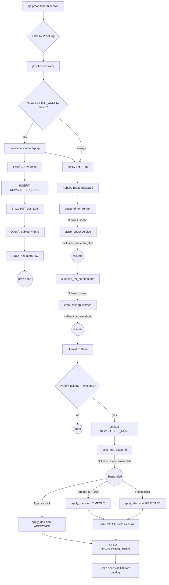

# CRM Proof Pipeline

Pipedream workflows for email QA, rendering, and newsletter content approval at McClatchy. This repo is synced to a Pipedream project — commits to `production` auto-deploy to the live workflows.

## What's in this repo

### Reusable services

Composable HTTP-triggered workflows that other workflows can call via callback.

- **`email-test-api-p_WxCpReW/`** — POST `{ html_body, callback_url }` → submits the HTML directly to Email on Acid, polls for completion with `$.flow.rerun`, POSTs screenshots to the callback URL. Works in ~3-7 minutes (no Braze round-trip, no subject-based search). Used for email QA and can be called by any workflow or tool (including Claude) to validate rendered HTML.
- **`braze-render-p_vQCkbQW/`** — POST `{ liquid, callback_url }` → sends the Liquid through Braze to a dedicated Pipedream email address. Braze renders the Liquid. The rendered HTML is captured by `braze-email-capture` and POSTed back to the callback URL. Used when you need to render Liquid/personalization before testing.
- **`braze-email-capture-p_ZJCr8lx/`** — internal email-triggered workflow paired with `braze-render`. Receives the rendered email from Braze, looks up the callback URL in a shared data store (`ds_7QundV5`) keyed by subject, and POSTs the rendered HTML to the caller.

### Proof orchestrator

Per-campaign QC orchestration: checks newsletter config, triggers content-prep, delays until T-1h, renders Liquid via braze-render, gets screenshots via email-test-api, uploads to Google Drive, and (for newsletters) posts a Slack approval message.

- **`qc-proof-scheduler-p_5VCPmd9/`** — cron-style scheduler. Fetches today's scheduled Braze messages, filters by the `Proof` tag, and POSTs each item to the proof orchestrator.
- **`proof-ochestrator-p_vQCkbBw/`** — the main per-campaign workflow. For each Braze item:
  1. Checks `NEWSLETTER_CONFIG` in Snowflake — if match, fires `newsletter-content-prep` (fire-and-forget)
  2. Delays until T-1h via `$.flow.delay`
  3. Rebuilds the Braze message to extract the Liquid template
  4. **Suspends** (`$.flow.suspend`) and calls braze-render with the `resume_url` as callback. Resumes when rendered HTML is delivered.
  5. **Suspends** again and calls email-test-api with the rendered HTML. Resumes when screenshots are delivered.
  6. Uploads screenshots to Google Drive (`YYYY-MM-DD/{campaign}/`)
  7. Filter: continues only if campaign has `Proof/Slack` tag and it's a weekday
  8. (Disabled) Newsletter approval: looks up `NEWSLETTER_RUNS`, posts Slack Block Kit message with Approve/Reject buttons, **suspends** until button click or T-10m timeout, then applies the decision.

### Newsletter content pipeline

Locks stories into a Braze catalog, generates AI subject/intro, writes history to Snowflake.

- **`newsletter-content-prep-p_zAC1lWL/`** — per-newsletter prep. Reads per-newsletter config from Snowflake (supports multi-feed via `FEED_SOURCES` VARIANT column), fetches story feeds, inserts a `NEWSLETTER_RUNS` row (UUID via `UUID_STRING()`), upserts `slot_1..slot_N` rows into the Braze catalog, calls OpenAI to generate `ai_subject` + `ai_intro`, upserts the `meta` row with the AI content, and writes it all to Snowflake history. Then exits — no waiting. The approval wait happens later in the orchestrator.
- **SQL DDL:** `newsletter-content-prep-p_zAC1lWL/sql/schema.sql` — `NEWSLETTER_CONFIG` and `NEWSLETTER_RUNS` table definitions. Tables live in `MCC_RAW.MARKETING_DEV`.

### Inactive

- **`qc-slack-approval-p_JZCz5G5/`** — legacy Slack message viewer (inactive).

---

## Standard newsletter flow



Timing summary:

| Time | Event |
|------|-------|
| Early morning | Scheduler runs, orchestrator fires content-prep (fire-and-forget) |
| Early morning | Content-prep locks stories + generates AI, exits |
| T-1h | Orchestrator resumes from delay, rebuilds message |
| T-1h | **Suspend 1:** braze-render renders Liquid via Braze |
| ~T-55m | **Suspend 2:** email-test-api creates EOA test, polls for screenshots |
| ~T-45m | Screenshots uploaded to Drive |
| ~T-45m | **Suspend 3:** Slack approval message posted (if newsletter + weekday) |
| T-10m | Suspension times out if no click -> auto-reject |
| T-0 | Braze sends the actual campaign using whatever is in the catalog |

---

## Required integrations

| Service | Purpose | Pipedream auth provision |
|---|---|---|
| Pipedream | Workflow runtime + GitHub sync | N/A |
| Braze | Sends, catalogs, messages | `apn_0WhgpWJ` (send), `apn_1Khpe1W` (rebuild), `apn_6LhOGA9` (catalogs) |
| Email on Acid | Screenshot QA (via email-test-api) | `apn_b6hZOVx` |
| Google Drive | Proof screenshot archive | `apn_mnh5B9x` |
| Slack | Approval UX + proof notifications | configured per workflow |
| OpenAI | AI subject/intro generation | `apn_QPhO4kd` |
| Snowflake | `MCC_RAW.MARKETING_DEV` config + history | `apn_yghdQYJ` |

---

## Snowflake schema

Tables live in `MCC_RAW.MARKETING_DEV`. DDL: [`newsletter-content-prep-p_zAC1lWL/sql/schema.sql`](newsletter-content-prep-p_zAC1lWL/sql/schema.sql).

- **`NEWSLETTER_CONFIG`** — per-newsletter config. `NEWSLETTER_KEY` must exactly match the Braze campaign or canvas name. Columns include `FEED_SOURCES` (VARIANT — ordered array of `{url, count, label?}` feed specs), `BRAZE_CATALOG_ID`, `MAX_STORIES`, `SLACK_CHANNEL_ID`, `APPROVERS` (array of Slack user IDs), `AI_PROMPT_TEMPLATE`, `AI_MODEL`.
- **`NEWSLETTER_RUNS`** — one row per send. Tracks `STORIES` (VARIANT), `AI_SUBJECT`, `AI_INTRO`, `DECISION` (`PENDING`/`APPROVED`/`REJECTED`/`TIMEOUT`), `DECIDED_AT`, `FINALIZED_AT`.

Run IDs are generated by `UUID_STRING()` inside the workflow (no JS crypto dependency).

---

## Development workflow

**Auto-deploy:** Commits pushed to the `production` branch are automatically synced to Pipedream. Pipedream may push its own changes back (e.g., writing auth provision IDs into `workflow.yaml` after you connect an app in the UI) — always `git pull` before starting work.

**Connected accounts must be workspace-shared.** Private account connections cause "private auth mismatch" deployment errors on GitHub sync. If you hit this, open Pipedream -> Accounts -> the connected account -> share with workspace.

**Entry.js pattern:**
```js
import { axios } from "@pipedream/platform";

export default defineComponent({
  props: {
    someApp: { type: "app", app: "some_app" },
  },
  async run({ steps, $ }) {
    const prior = steps.previous_step.$return_value;
    // ...
  },
});
```

YAML `{{expression}}` props and `type: "action"` both work; neither was the cause of the errors earlier in this project's history (those were all symptoms of the auth mismatch issue). Use whichever pattern fits.

**Branches in Pipedream UI:** Pipedream has its own notion of branches (distinct from git branches). For most work, commit directly to `production`. If you need a staging environment, create a Pipedream branch and point it at a git feature branch.

**Debugging workflows via the REST API:**
```bash
# List recent errors for a workflow
curl -s -H "Authorization: Bearer $PIPEDREAM_API_KEY" \
  "https://api.pipedream.com/v1/workflows/p_XXXXXXX/\$errors/event_summaries?expand=event&limit=5&org_id=o_qOIvyEa" \
  | python3 -m json.tool
```

---

## Rollout status

| Workflow | Status |
|---|---|
| `email-test-api` | Production, end-to-end verified |
| `braze-render` + `braze-email-capture` | Production, end-to-end verified |
| `qc-proof-scheduler` | Production (currently inactive), points at orchestrator |
| `proof-ochestrator` (proof steps) | Scaffolded, needs `braze_render_url` and `email_test_api_url` props set in Pipedream UI |
| `proof-ochestrator` (newsletter approval steps) | Scaffolded, disabled — needs Slack/Braze auth + catalog |
| `newsletter-content-prep` | Scaffolded, Snowflake tables created, Trailhead pilot seeded (ENABLED=FALSE) |

Before enabling the newsletter flow end-to-end:
1. ~~Run the DDL at `newsletter-content-prep-p_zAC1lWL/sql/schema.sql`~~ Done
2. ~~Seed at least one pilot row in `NEWSLETTER_CONFIG`~~ Done (Trailhead, ENABLED=FALSE)
3. Create the corresponding Braze catalog (with the `meta` row and `slot_1..N` item IDs)
4. Set `braze_render_url` and `email_test_api_url` props on orchestrator suspend steps in Pipedream UI
5. Set `content_prep_url` prop on `trigger_content_prep` step
6. Set the Slack approval channel on `post_and_suspend` and flip `dry_run` to false
7. Enable `lookup_newsletter_run`, `post_and_suspend`, `apply_decision` steps in orchestrator
8. `UPDATE MCC_RAW.MARKETING_DEV.NEWSLETTER_CONFIG SET ENABLED = TRUE WHERE NEWSLETTER_KEY = 'crm_trailhead_nonsubnl'`

---

## Smoke tests

**Email Test API:**
```bash
curl -s -X POST https://eoihl6hmsymk4tc.m.pipedream.net \
  -H "Content-Type: application/json" \
  -d '{"html_body":"<h1>Test</h1>","callback_url":"https://your-webhook-here"}'
```

**Braze Render:**
```bash
curl -s -X POST https://eov0l2spkm1h5vp.m.pipedream.net \
  -H "Content-Type: application/json" \
  -d '{"liquid":"<h1>Hi {{user.first_name|default:\"friend\"}}</h1>","callback_url":"https://your-webhook-here"}'
```

Both return `{ "status": "accepted", "subject": "..." }` immediately. Full results arrive at the callback URL within a few minutes.
